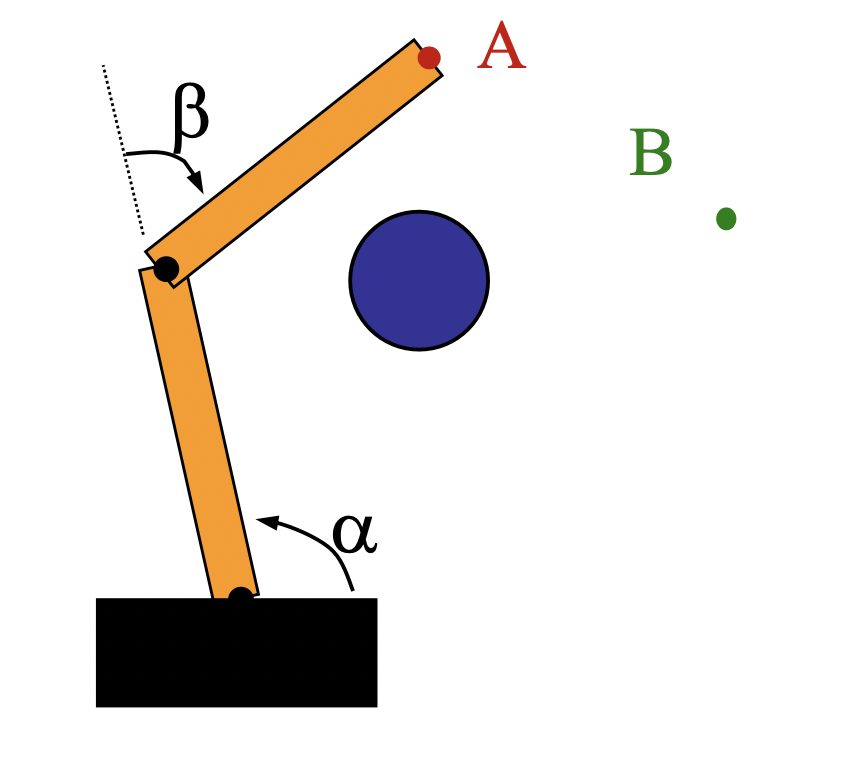
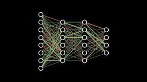
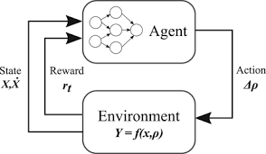

# RL-for-path-planning
In this repository we will create simple reinforcement learning algorithm for path planning in different robotic settings
Continuous Action Robotic Arm: 

This repository demonstrates continuous action reinforcement learning in the specific context of robotic arms moving through a configuration space.  

 

<h3>Abstract Motivation:</h3> 

The vast majority of robotic arms used in real-world applications today are hard-coded to follow a certain trajectory when doing a specific task. In dynamic situations in which obstacles may come in the way of a specific trajectory or a specific target of the arm moves positions, such arms will fail to perform adequately. 

 

In response this repository demonstrates the potential for deep reinforcement learning as a potential avenue for creating robotic arms that can operate in dynamic environments.  

 

<h3>Continuous Action Deep Reinforcement Learning as applied to Robotic arms:</h3> 

To understand the concept of deep reinforcement learning one must first understand: 
<ol>
	<li>Robotics configuration spaces</li>
   	<li>Deep neural networks</li>  
	<li>Discrete reinforcement learning</li>  
	<li>Continuous action reinforcement learning</li>
</ol>  

<h3>The Basics of Robotic Configuration Spaces:</h3> 

A robotic configuration space plots the different positions of actuators that are possible in an environment with obstacles. For instance, consider the following robotic arm and the following configuration space.  

<h4>Robotic arm:</h4> 
 

<h4>Configuration space:</h4> 

The shaded area above represents points at which the arm, with that particular alpha and beta values, would crash into the obstacle 

The unshaded area represents all the points at which the arm would represents points at which the robot, with that particular alpha and particular alpha and beta values, would not be crashing into the obstacle. 

<h3>Deep Neural Networks:</h3>

Deep neural networks. I’m going to keep this very high level. A deep neural network is a function approximator that uses multiple levels of neurons to simulate a mathematical function. A neural network will be used as the mathematical tool for us to implement our algorithm.The algorithm uses forward propogation to calculate predictions and learns through taking complex gradients and propogating them backwards through the network.

<h4>An example of a neural network</h4>

<h3>Discrete Reinforcement Learning</h4> 
Discrete reinforcement learning invovles taking a representation of the state at a point in time as the input. The algorithm then accordingly computes the probabilities for the best move as a result. The next move that is taken is the move that returns the highest probability. Some type of reward/value is associated with each move and is fed back to the original nerual network. This is back propogated through the network and the weights are updated. 

<h4>Discrete reinforcement learning neural network</h4> 
 

<h3>Continous reinforcement learning</h3> 
The same above strategy is applied but instead of learning discrete probabilities and taking an argmax, the algorithm learns an optimal normal distriution with a mean and a variance. This provides the flexibility needed for a continuous setting like a robot.

